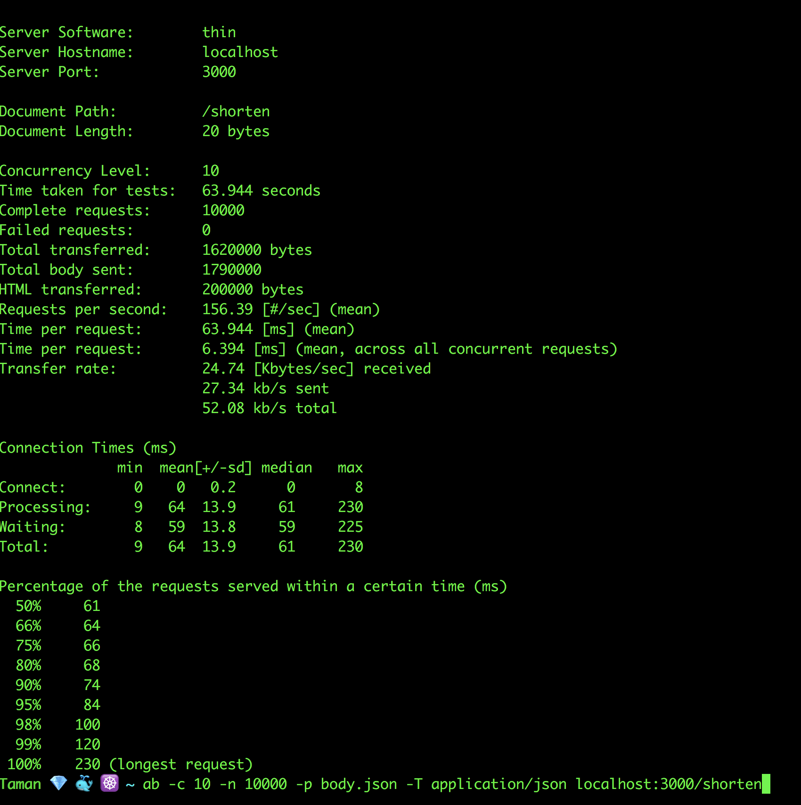
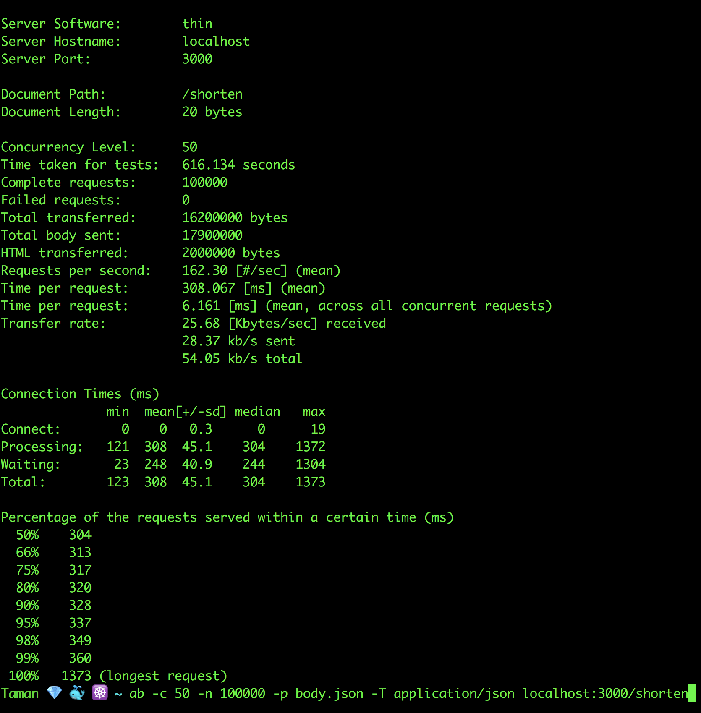
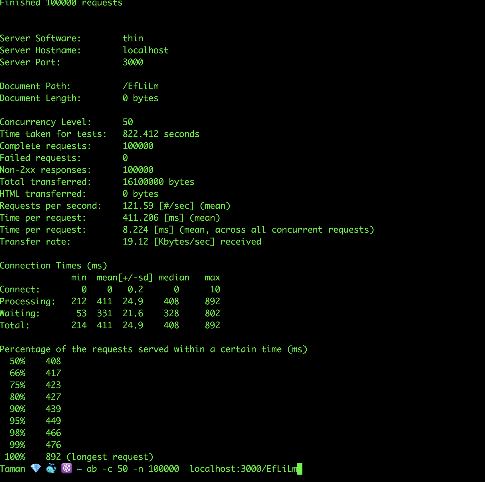

# URL Shortner

A simple and easy to use APIs built using [Sinatra](https://github.com/sinatra/sinatra) & [PostgreSQL](https://www.postgresql.org/).

## Installation

To run app locally you have to use [Docker Compose](https://docs.docker.com/compose/).

```bash
docker-compose up
```

## Running Tests

To run tests you have to do these commands

```bash
docker-compose run -e RACK_ENV=test api rake db:migrate
docker-compose run api rspec
```

## Results

I've used [Apache Bench(ab)](https://httpd.apache.org/docs/2.4/programs/ab.html) load testing for benchmark.
I know these statistics will differ depending on machine, however I make this benchmark to check below points
* App genereates unique token under heavy requests and will not throw postgres unique exception.
* Handling race condition & see if the redirect count increments consistently.
* Make performance improvements in the application.

### POST /shorten

      

### GET /:shortcode

      

## Improvement

I've made another branch **improve_generate_shortcode** you could check it using the following steps

```bash
docker-compose down # in case application is running on master branch
git checkout improve_generate_shortcode
docker-compose up
```

Mainly I've made this branch to make another way of generating unique shortcode, as I think the way
I've used in master branch by checking shortcode is not present in the database every time we generate shortcode is a little bit naive & may be won't work properly when scaling.

Using unique counter that increments in a bijective function which will encode any integer into string.
Since counter will be unique, the shortcode also will be unique & we won't have to check the database.
